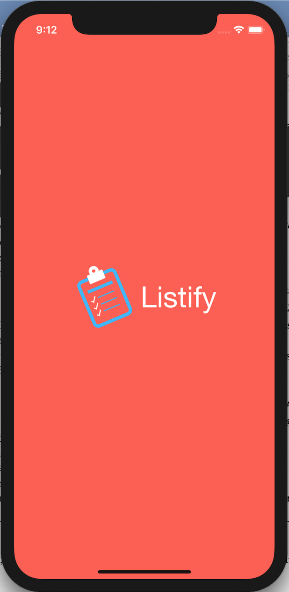
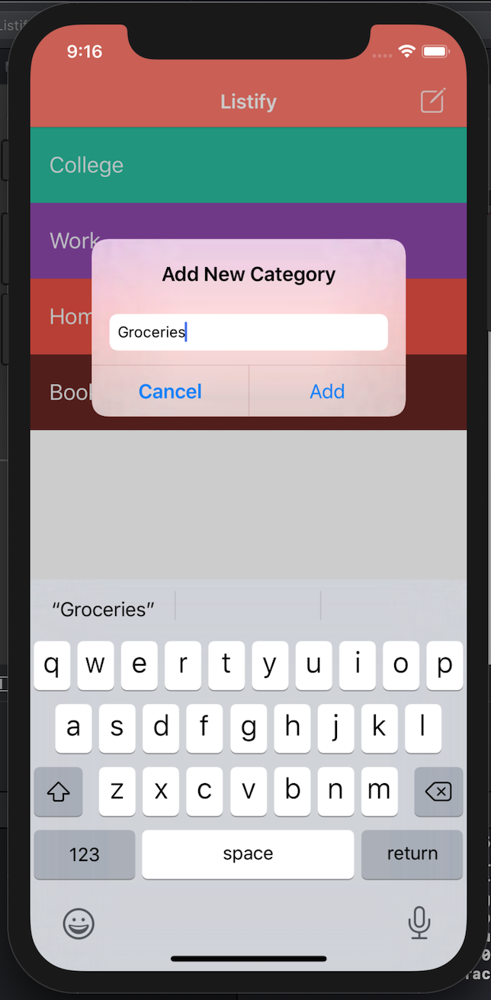
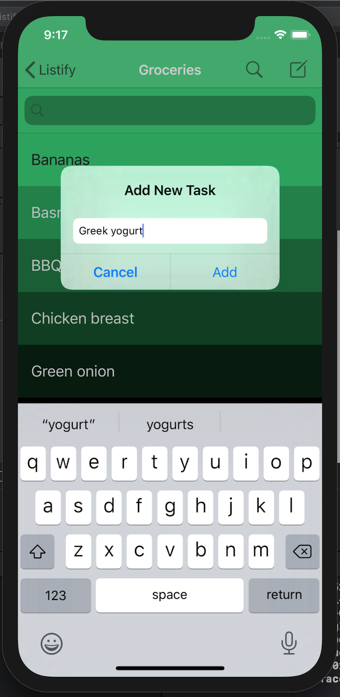
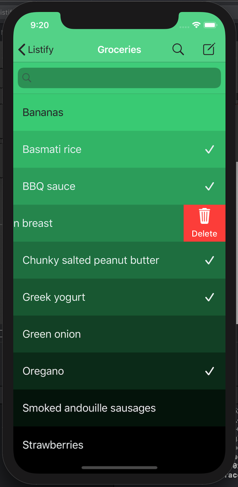

## Overview
A productivity to-do list app that allows users to create to-do lists under different categories.

## Libraries used
- [Chameleon](https://github.com/viccalexander/Chameleon)
- [SwipeCellKit](https://github.com/SwipeCellKit/SwipeCellKit)

## Frameworks used
- Realm Swift

## Demonstration

 

 

